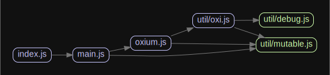

# Oxium

[![GitHub package.json version][package-version-badge]](package.json)
[](https://app.fossa.io/projects/git%2Bgithub.com%2Fhobroker%2Foxium?ref=badge_shield)

[![License][package-license-badge]](LICENSE)
![GitHub top language][top-lang-badge]
[![GitHub issues][github-issues-badge]][github-issues-link]

[![Snyk Vulnerabilities][snyk-badge]][snyk-link]
[![LGTM][lgtm-badge]][lgtm-link]

---

## ⚙️ Installation

```bash
npm install hobroker/oxium
```



## 💬 Contributing

- [Code of Conduct](CODE_OF_CONDUCT.md)
- [Contributing Guideline](CONTRIBUTING.md)

## 📜 License

This project is licensed under the MIT License - see the [LICENSE.md](LICENSE) file for details

---

[![Buy Me A Coffee][buymeacoffee-badge]][buymeacoffee-link]

[buymeacoffee-link]: https://www.buymeacoffee.com/hobroker
[buymeacoffee-badge]: https://www.buymeacoffee.com/assets/img/guidelines/download-assets-sm-2.svg
[package-version-badge]: https://img.shields.io/github/package-json/v/hobroker/oxium
[package-license-badge]: https://img.shields.io/github/license/hobroker/oxium
[github-issues-badge]: https://img.shields.io/github/issues/hobroker/oxium?logo=github
[github-issues-link]: https://github.com/hobroker/oxium/issues
[maintained-badge]: http://isitmaintained.com/badge/resolution/hobroker/oxium.svg
[maintained-link]: http://isitmaintained.com/project/hobroker/oxium
[top-lang-badge]: https://img.shields.io/github/languages/top/hobroker/oxium?logo=javascript
[snyk-badge]: https://img.shields.io/snyk/vulnerabilities/github/hobroker/oxium?logo=snyk
[snyk-link]: https://snyk.io/test/github/hobroker/oxium
[lgtm-badge]: https://img.shields.io/lgtm/alerts/g/hobroker/oxium.svg?logo=lgtm&logoWidth=18
[lgtm-link]: https://lgtm.com/projects/g/hobroker/oxium/context:javascript


[](https://app.fossa.io/projects/git%2Bgithub.com%2Fhobroker%2Foxium?ref=badge_large)